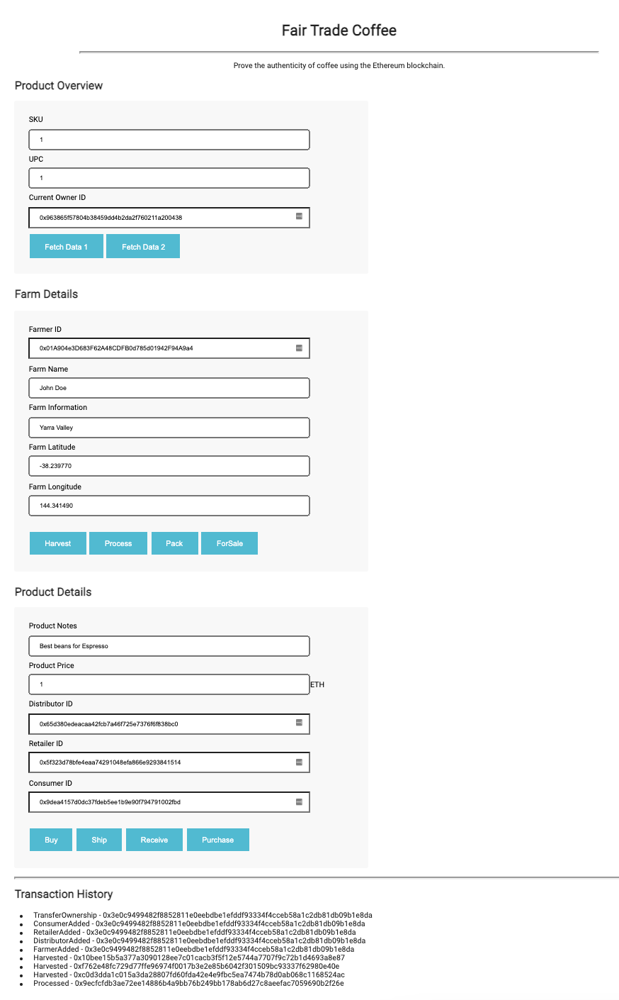
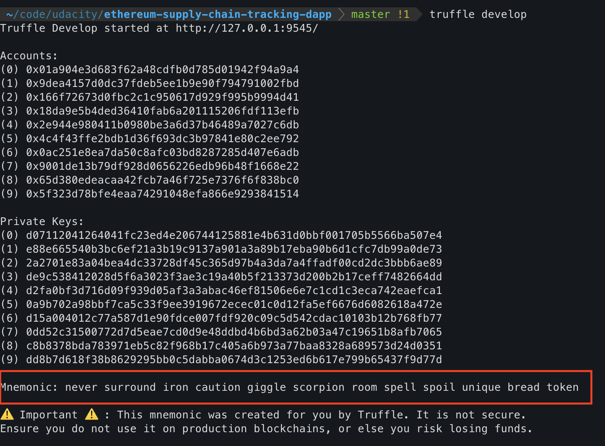
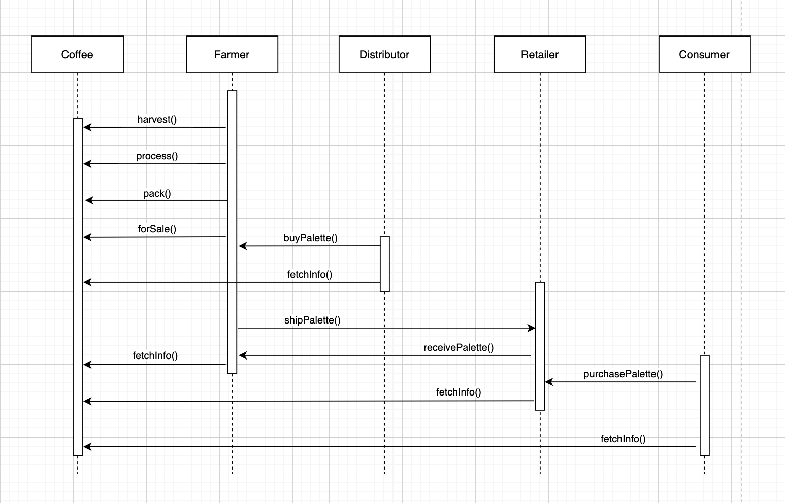
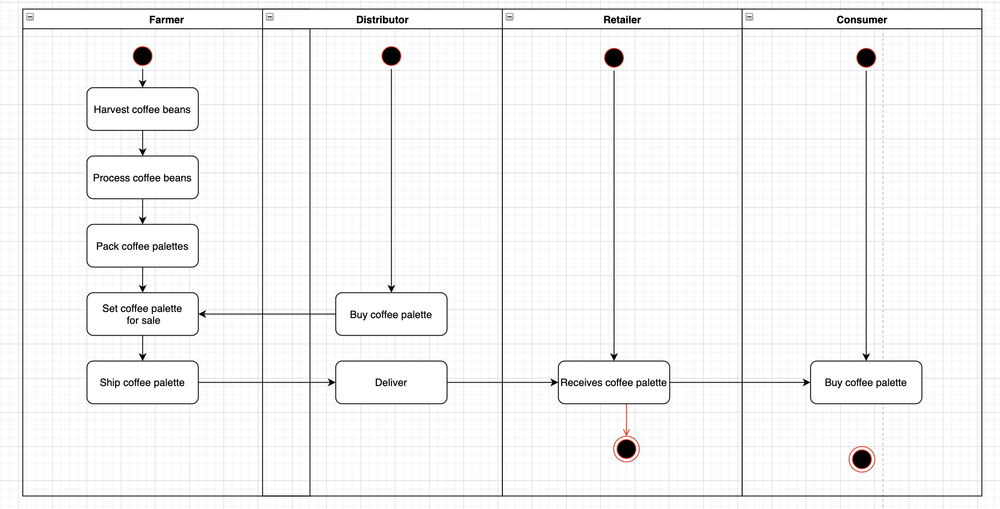
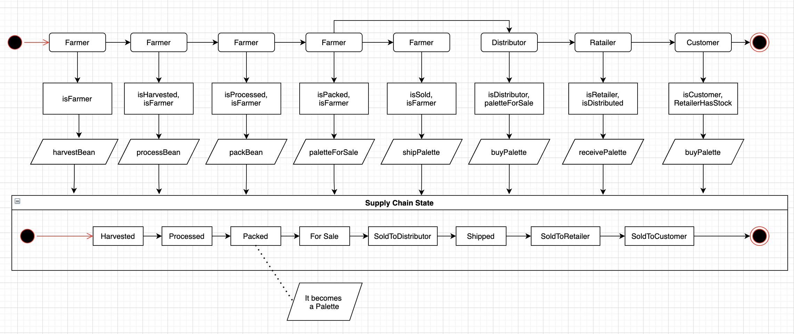
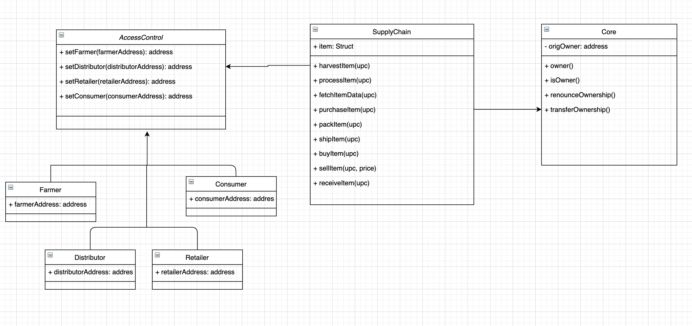

# Ethereum DApp for Tracking Items Through the Supply Chain

I created a DApp supply chain solution to prove the authenticity of coffee by leveraging the transparency, traceability and efficiency of the Ethereum blockchain network. I built smart contracts that manage specific user permission controls as well as contracts that track and verify a product’s authenticity.

Here is a how the dapp interface looks like:



Refer to [Project Arquitecture](#project-arquitecture) section to get a better picture on how the system works.
## Getting Started

These instructions will get you a copy of the project up and running on your local machine for development and testing purposes. See the [deployment](#deployment) notes on how to deploy the project on a live system.

### Prerequisites

1. Please make sure you've enabled <a href="https://metamask.io/" target="_blank">MetaMask</a> extension in your browser.

2. Install <a href="https://www.trufflesuite.com/docs/truffle/getting-started/installation" target="_blank">Truffle</a> in your system:
```
npm install -g truffle
```

### Tested libraries

This project was tested using these libraries:
```
Truffle v5.3.6 (core: 5.3.6)
Solidity - 0.5.16 (solc-js)
Node v12.16.1
Web3.js v1.3.5
```
### Installing

Clone this repository:

```
git clone https://github.com/diasgab/ethereum-supply-chain-tracking-dapp.git
```

Install all required npm packages (as listed in ```package.json```):

```
npm install
```

Copy the .env.dist file to .env and fill in the infura key and mnemonic from Metamask wallet (you will only need the mnemonic to [deploy](#deployment) to production systems):
```
cp .env.dist .env
```

Run truffle to start your local blockchain:
```
truffle develop
```



**NOTE**: Save the mnemonic if you want to test the application running Gannache-cli.

Compile the contracts using truffle:
```
truffle(develop)> compile
```

Run migrations:
```
truffle(develop)> migrate
```
Run tests:
```
truffle(develop)> test
```

In a new terminal run the frontend app:
```
npm run dev
```


Open your browser on http://localhost:3000 and you should see the app like in the demo image shown before.

## Using the application

In order to use the app you will need to configure your metamask extension to work with your local blockchain.

Refer to this [documentation](https://www.trufflesuite.com/docs/truffle/getting-started/truffle-with-metamask) to do it so.

Then you will need to [import one of your Truffle accounts into metamask](https://metamask.zendesk.com/hc/en-us/articles/360015489331-How-to-import-an-Account) to be able to interact with the application.

## Using ganache

If you want to use ganache-cli follow these steps

1. Install Ganache-cli in your system:
```
npm install -g ganache-cli
```
2. Run ganache using the same mnemonic than before:
```
ganache-cli -m "SEED FROM THE .env FILE"
```

3. In the development section in truffle-config.js, change the port from 9545 to 8545.

4. Deploy your contracts in Ganache (exit truffle before runninng this command):
```
truffle migrate --reset
```

5. Configure Metamask to work with Ganache. You will have to follow the same steps from before but with a different port.

## Deployment

In order to deploy these contracts in the Rikeby network you will have to provide a valid Infura API key and save it to yout .env file.

You will also need some test eher in your metamask (you can use any test faucet to get it).

You will need the mnemonic from your test metamask and save it to your .evn file.

Then run:
```
truffle migrate --reset --network rinkeby
```

## Already deployed contracts
```
FarmerRole contract address: 0xCf89c4062CB09a1c448473b0f1a4013F207284ba
DistributorRole contract address: 0xbc6f847162585154BB22be4d904584B5931372cC
RetailerRole contract address: 0xD4fe7952dD633a08694984EbA7E8Ed43B44E8B0C
ConsumerRole contract address: 0xE11014630023C0A89df72E80eFAa754a28721202
SupplyChain contract address: 0x74DFC2bD6a570C4e4e244732308e14C552b70F5d
```
## Project arquitecture

UML Sequence diagram


UML Activity diagram


UML State diagram


UML Data diagram
